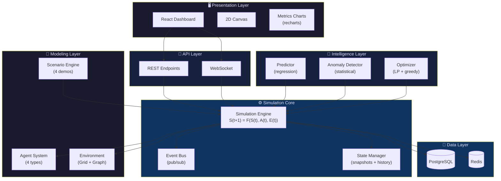

<div align="center">


# 🌍 WorldSim AI

**AI-Powered Digital Twin Simulation Platform**

[](https://python.org)
[](https://fastapi.tiangolo.com)
[](https://reactjs.org)
[](https://numpy.org)
[](LICENSE)
[](https://docker.com)
[](CONTRIBUTING.md)

</div>

---

> **Model, predict, and optimize real-world systems** — cities, factories, energy grids, logistics, and environments. Research-grade simulation with a beautiful web dashboard. 100% free, 100% open-source.

---

## ✨ Features

| Feature | Description |
|---------|-------------|
| 🧬 **Agent-Based Modeling** | Vehicles, humans, machines, energy units with customizable rule-based & probabilistic behaviors |
| 🌐 **Environment Modeling** | 2D grid & graph worlds with 8 zone types (residential, industrial, commercial, roads, parks, power plants, water treatment, warehouses) |
| 🧠 **AI & Optimization** | Linear regression prediction, anomaly detection, LP-based resource allocation, priority scheduling |
| 📊 **Real-Time Dashboard** | Live 2D canvas visualization, agent tracking, heatmaps, and interactive metrics charts |
| 🔬 **Research Framework** | Deterministic mode (reproducible), state snapshots, experiment comparison, benchmarking |
| 📡 **REST + WebSocket API** | Full FastAPI backend with async simulation execution and real-time streaming |
| 🎮 **4 Demo Scenarios** | Smart City Traffic, Factory Optimization, Energy Balancing, Emergency Failure |
| 🔌 **Plugin Architecture** | Extensible agents, behaviors, environments, AI modules — all via clean interfaces |
| 🐳 **One-Command Setup** | `docker-compose up` and everything is running — backend, frontend, database, cache |

## 🏗 Architecture



### Formal Model

Every simulation step follows:

```
S(t+1) = F(S(t), A(t), E(t))
```

- **S(t)** — System state at time t (resources, metrics, counters)
- **A(t)** — Agent actions at time t (movement, production, consumption)
- **E(t)** — Environment factors at time t (zones, traffic, energy grid)
- **F** — Transition function (combines all inputs → next state)

This ensures **reproducibility** (deterministic mode with seed) and **extensibility** (swap any component).

## 🚀 Quick Start

### Option 1: Docker (recommended)

```bash
git clone https://github.com/rudra496/worldsim-ai.git
cd worldsim-ai
docker-compose up --build
```

👉 Open [http://localhost:3000](http://localhost:3000)

### Option 2: Python only (no frontend)

```bash
git clone https://github.com/rudra496/worldsim-ai.git
cd worldsim-ai
pip install -r requirements.txt
python run_demo.py
```

### Option 3: Full local dev

```bash
# Backend
pip install -r requirements.txt
uvicorn worldsim.api.main:app --reload --port 8000

# Frontend (separate terminal)
cd frontend && npm install && npm start
```

## 🎮 Demo Scenarios

| # | Scenario | Description | Agents | Zones | Ticks |
|---|----------|-------------|--------|-------|-------|
| 🏙️ | **Smart City Traffic** | Urban traffic with vehicles & pedestrians across residential, commercial, and industrial zones | 105 | 8 | 300 |
| 🏭 | **Factory Optimization** | Production line optimization with machines, workers, and energy constraints | 68 | 3 | 500 |
| ⚡ | **Energy Balancing** | Multi-source energy grid with solar plants and varying demand patterns | 85 | 8 | 400 |
| 🚨 | **Emergency Failure** | System resilience testing under power outages and machine breakdowns | 76 | 6 | 400 |

## 📁 Project Structure

```
worldsim-ai/
├── 🐍 worldsim/                    # Python simulation engine
│   ├── core/                       # Engine, state, events
│   │   ├── engine.py               # SimulationEngine — S(t+1) = F(S(t), A(t), E(t))
│   │   ├── state.py                # StateManager, snapshots, diffs
│   │   └── events.py               # EventBus (pub/sub), EventType
│   ├── agents/                     # Agent-based modeling
│   │   ├── models.py               # Vehicle, Human, Machine, EnergyUnit + Registry
│   │   └── behaviors.py            # RuleBased, Probabilistic behaviors
│   ├── environment/                # World representation
│   │   ├── world.py                # GridWorld, GraphWorld, Zone system
│   │   └── resources.py            # ResourceManager (energy, water, materials)
│   ├── ai/                         # Intelligence layer
│   │   ├── predictor.py            # SimplePredictor, AnomalyDetector
│   │   └── optimizer.py            # ResourceAllocator (LP), SimpleScheduler
│   ├── scenarios/                  # Experiment engine
│   │   ├── engine.py               # ScenarioEngine — run & compare
│   │   └── definitions.py          # 4 predefined scenario configs
│   ├── api/                        # FastAPI backend
│   │   └── __init__.py             # REST + WebSocket endpoints
│   ├── data/                       # Data pipeline
│   │   └── generator.py            # Synthetic data, validation
│   └── utils/                      # Config & metrics
│       ├── config.py               # YAML/JSON config manager
│       └── metrics.py              # MetricsCollector, ResultsExporter
│
├── ⚛️ frontend/                    # React visualization
│   ├── src/
│   │   ├── components/             # Canvas, Charts, Controls
│   │   ├── services/api.js         # Backend API client
│   │   ├── utils/simulation.js     # Color maps, demo data
│   │   └── App.js                  # Main dashboard
│   ├── Dockerfile                  # Multi-stage build (node → nginx)
│   └── nginx.conf                  # API proxy + SPA fallback
│
├── 📁 config/default.yaml          # Default simulation config
├── 🧪 tests/test_engine.py         # Test suite
├── 📄 docs/                        # Documentation
├── 🐳 docker-compose.yml           # One-command deploy
├── 🐳 Dockerfile                   # Backend image
└── 🎮 run_demo.py                  # Quick demo runner
```

## 🛠 Tech Stack

| Layer | Technology | Why |
|-------|-----------|-----|
| **Simulation** | Python 3.11+, NumPy | Fast numerical computation, scientific ecosystem |
| **API** | FastAPI, Uvicorn, WebSockets | Async, auto-docs, type-safe |
| **AI/Optimization** | NumPy, SciPy | Linear regression, LP optimization |
| **Frontend** | React 18, recharts, Canvas | Modern UI, beautiful charts |
| **Database** | PostgreSQL 15 | Reliable persistent storage |
| **Cache** | Redis 7 | Fast session & result caching |
| **Deployment** | Docker, Nginx | Containerized, production-ready |

## 🔬 Research Features

- ✅ **Deterministic mode** — Same seed → identical results every time
- ✅ **State snapshots** — Checkpoint and restore at any tick
- ✅ **State diffs** — Track exactly what changed between ticks
- ✅ **Event logging** — Full pub/sub event bus for analysis
- ✅ **Metrics collection** — Efficiency, throughput, stability, utilization + aggregation
- ✅ **Experiment comparison** — Run same scenario with different params, compare side-by-side
- ✅ **Multiple export formats** — JSON, CSV, structured text reports
- ✅ **Config-driven** — YAML configs for everything, no hardcoded values

## 📊 API Endpoints

| Method | Endpoint | Description |
|--------|----------|-------------|
| `GET` | `/` | API health & info |
| `GET` | `/scenarios` | List available scenarios |
| `POST` | `/simulations/start` | Start a new simulation |
| `GET` | `/simulations` | List all simulations |
| `GET` | `/simulations/{id}` | Get simulation status |
| `GET` | `/simulations/{id}/results` | Get simulation results |
| `GET` | `/simulations/{id}/metrics` | Get aggregated metrics |
| `WS` | `/ws/simulations/{id}` | Real-time updates |

## 🗺 Roadmap

- [x] **v0.1** — Core engine, 4 agent types, grid/graph worlds, AI prediction + optimization, 4 scenarios, REST + WebSocket API, React dashboard, Docker
- [ ] **v0.2** — PyTorch models, RL agents, multi-agent AI system, feedback loops
- [ ] **v0.3** — 3D visualization (Three.js/WebGL), camera controls, terrain
- [ ] **v0.4** — IoT/sensor data ingestion, MQTT support, live anomaly alerting
- [ ] **v0.5** — Distributed simulation, multi-node scaling, gRPC communication
- [ ] **v1.0** — Full digital twin with live data, GIS integration, plugin marketplace

## 🤝 Contributing

Contributions are welcome! See [CONTRIBUTING.md](CONTRIBUTING.md) for guidelines.

**What we're looking for:**
- 🆕 New agent types and behavior models
- 🌍 New scenarios (epidemics, supply chain, climate...)
- 📊 Visualization improvements
- 📝 Documentation fixes and tutorials
- 🐛 Bug reports and feature requests

## 📄 License

This project is licensed under the **MIT License** — see [LICENSE](LICENSE) for details.

---

<div align="center">

**Built with ❤️ by the WorldSim AI Community**

*Model the world. Optimize the future. Open source forever.* 🌍

</div>
