<div align="center">

<!-- Stargazers — dynamic showcase -->
<a href="https://github.com/rudra496/worldsim-ai/stargazers">
  
</a>

<br><br>


# 🌍 WorldSim AI

**AI-Powered Digital Twin Simulation Platform**

<p>
<strong>Model, predict, and optimize real-world systems</strong> — smart cities, factories, energy grids, logistics networks, and more. Feature-rich agent-based simulation with real-time 3D visualization, reinforcement learning, IoT data ingestion, distributed scaling, and digital twin capabilities. Free and open-source (MIT).
</p>

> If you find this project useful, please consider giving it a ⭐ star — it helps more developers discover it!

[](https://github.com/rudra496/worldsim-ai/stargazers)
[](https://github.com/rudra496/worldsim-ai/network/members)
[](https://github.com/rudra496/worldsim-ai/watchers)
[](https://github.com/rudra496/worldsim-ai/discussions)

[](https://python.org)
[](https://fastapi.tiangolo.com)
[](https://reactjs.org)
[](https://threejs.org)
[](https://numpy.org)
[](https://pytorch.org)
[](LICENSE)
[](https://docker.com)
[](CONTRIBUTING.md)
[](https://github.com/rudra496/worldsim-ai/releases/tag/v0.1.0)

</div>

---

## ⚡ One Command Start

```bash
git clone https://github.com/rudra496/worldsim-ai.git
cd worldsim-ai
docker-compose up --build
# 👉 Open http://localhost:3000
```

<details>
<summary>📦 Alternative: Python-only (no frontend)</summary>

```bash
pip install -r requirements.txt
python run_demo.py
```

</details>

<details>
<summary>🔧 Alternative: Full local development</summary>

```bash
# Backend
pip install -r requirements.txt
uvicorn worldsim.api.main:app --reload --port 8000

# Frontend (separate terminal)
cd frontend && npm install && npm start
```

</details>

---

## ✨ Complete Feature Set

### 🧬 Agent-Based Modeling
- **4 agent types**: Vehicle, Human, Machine, EnergyUnit — each with customizable properties
- **Rule-based & probabilistic behaviors** — deterministic or stochastic movement, production, consumption
- **Multi-agent AI system** — autonomous Planner, Predictor, and Optimizer agents coordinate via AgentCoordinator

### 🌐 Environment Modeling
- **2D grid & graph world** representations with configurable dimensions
- **8 zone types**: residential, industrial, commercial, road, park, power_plant, water_treatment, warehouse
- **Resource management** — energy, water, materials, bandwidth with production/consumption tracking

### 🧠 AI & Machine Learning
- **PyTorch LSTM predictor** — deep time-series forecasting (NumPy fallback when PyTorch unavailable)
- **Autoencoder anomaly detection** — unsupervised drift and outlier detection
- **LP-based resource optimization** — scipy linear programming for allocation
- **Priority scheduling** — greedy heuristic for task ordering
- **Reinforcement learning** — Gymnasium-compatible environment with PPO/Q-learning agents
- **Adaptive feedback loops** — simulation → AI prediction → optimization → correction cycle

### 🎮 3D Visualization (Three.js)
- **Interactive 3D world** via React Three Fiber — orbit, pan, zoom controls
- **3D zone rendering** — translucent colored boxes with zone type labels
- **Agent 3D objects** — vehicles (boxes), humans (spheres), machines (cylinders), energy (glowing spheres)
- **Day/night cycle** — toggle between ambient lighting modes
- **2D ↔ 3D switcher** — seamless view switching

### 📡 Real-Time Data Ingestion
- **MQTT source** — subscribe to IoT sensor topics with JSON parsing (requires `paho-mqtt`)
- **File source** — CSV/JSON/JSONL ingestion with live tail support
- **REST API source** — periodic polling of external endpoints
- **Simulator source** — synthetic data with noise, drift, and failure injection
- **Alert manager** — CRITICAL/WARNING/INFO with configurable callbacks

### 🖥 Distributed Simulation
- **Multi-node engine** — extends core engine for horizontal scaling
- **Spatial partitioning** — grid-based agent distribution across nodes
- **Load balancing** — threshold-based rebalancing with migration plans
- **gRPC protocol** — dataclass-based message serialization (no protoc required)

### 🏙 Digital Twin
- **Live/replay/hybrid sync** modes — mirror real-world data or replay historical patterns
- **GIS integration** — GeoJSON loading, coordinate transforms, geofencing with ray-casting
- **Plugin system** — hot-reloadable plugins with ABC interface
- **Built-in plugins** — LoggingPlugin, MetricsExportPlugin (Prometheus), SlackNotifyPlugin
- **Plugin marketplace** — local catalog with built-in plugins (extensible to remote registries)
- **REST + WebSocket connector** — push/pull state, bidirectional sync
- **API key auth** with role-based access control
- **Rate limiting** — token bucket algorithm

### 📊 Dashboard & API
- **React SPA** — dark theme, responsive, works standalone in demo mode
- **Real-time WebSocket** — live simulation streaming to frontend
- **9 API endpoints** — scenarios, simulations, results, metrics, health + WebSocket
- **Metrics charts** — recharts for throughput, efficiency, stability, utilization
- **CLI tool** — `worldsim run`, `list`, `demo`, `serve`

### 🔬 Research Framework
- ✅ **Deterministic mode** — Same seed → identical results (reproducible experiments)
- ✅ **State snapshots** — Checkpoint and restore at any tick
- ✅ **Event bus** — Full pub/sub for simulation events
- ✅ **Multiple export formats** — JSON, CSV, structured text reports
- ✅ **Config-driven** — YAML configs, no hardcoded values

---

## 🗺 Roadmap

| Version | Status | Description |
|---------|--------|-------------|
| **v0.1** | ✅ Done | Core engine, 4 agent types, grid/graph worlds, AI prediction + optimization, 8 scenarios, REST + WebSocket API, React dashboard, Docker |
| **v0.2** | ✅ Done | PyTorch LSTM predictor (NumPy fallback), autoencoder anomaly detection, Gymnasium RL env, PPO/Q-learning agents, multi-agent AI system, adaptive feedback loops |
| **v0.3** | ✅ Done | Three.js 3D world (React Three Fiber), orbit controls, 3D zones/agents with glow, day/night cycle, 2D↔3D view switcher |
| **v0.4** | ✅ Done | MQTT/File/API/Simulator data sources, ingestion pipeline, ring buffer, data transformer, alert manager |
| **v0.5** | ✅ Done | Multi-node distributed engine, spatial partitioning, load balancing, gRPC protocol, message serialization |
| **v1.0** | ✅ Done | Digital twin core (live/replay/hybrid), GIS integration, plugin system + marketplace, REST/WebSocket connector, API auth, rate limiting |

> 📖 See [ROADMAP.md](ROADMAP.md) for detailed feature checklists.

---

## 🏗 Architecture

```mermaid
graph TB
    subgraph Presentation ["🖥️ Presentation Layer"]
        UI["React Dashboard"]
        Canvas["2D Canvas"]
        Three["3D View (Three.js)"]
        Charts["Metrics Charts"]
    end

    subgraph API ["📡 API Layer"]
        REST["REST Endpoints"]
        WS["WebSocket"]
        CLI["CLI Tool"]
    end

    subgraph Core ["⚙️ Simulation Core"]
        Engine["Simulation Engine<br/>S(t+1) = F(S(t), A(t), E(t))"]
        Events["Event Bus"]
        State["State Manager"]
    end

    subgraph Models ["🧬 Modeling Layer"]
        Agents["Agent System (4 types)"]
        Env["Environment (Grid + Graph)"]
        Scenarios["Scenario Engine"]
    end

    subgraph AI ["🧠 Intelligence Layer"]
        Predict["LSTM Predictor"]
        Detect["Anomaly Detector"]
        Optimize["LP Optimizer"]
        RL["RL Agents (PPO)"]
        MAS["Multi-Agent System"]
        Feedback["Feedback Loops"]
    end

    subgraph DataIO ["📡 Data Layer"]
        MQTT_S["MQTT Source"]
        File_S["File Source"]
        API_S["API Source"]
        Sim_S["Simulator Source"]
    end

    subgraph Twin ["🏙 Digital Twin"]
        GIS["GIS / GeoJSON"]
        Plugins["Plugin System"]
        Market["Marketplace"]
        Connector["Twin Connector"]
    end

    subgraph Dist ["📊 Distributed"]
        Nodes["Simulation Nodes"]
        Partition["Spatial Partitioning"]
        GRPC["gRPC Protocol"]
    end

    UI --> REST
    UI --> WS
    CLI --> Engine
    REST --> Engine
    WS --> Engine
    Engine --> Agents
    Engine --> Env
    Engine --> Events
    Engine --> State
    Scenarios --> Engine
    Predict --> Engine
    Detect --> Engine
    Optimize --> Engine
    RL --> Engine
    MAS --> Engine
    Feedback --> Engine
    MQTT_S --> Engine
    File_S --> Engine
    API_S --> Engine
    Sim_S --> Engine
    GIS --> Engine
    Plugins --> Engine
    Market --> Plugins
    Connector --> Engine
    Nodes --> Engine
    Partition --> Nodes
    GRPC --> Nodes
```



### Formal Model

Every simulation step follows:

```
S(t+1) = F(S(t), A(t), E(t))
```

- **S(t)** — System state at time t (resources, metrics, counters)
- **A(t)** — Agent actions at time t (movement, production, consumption)
- **E(t)** — Environment factors at time t (zones, traffic, energy grid)
- **F** — Transition function (combines all inputs → next state)

---

## 🎮 Demo Scenarios

| # | Scenario | Description | Agents | Zones | Ticks |
|---|----------|-------------|--------|-------|-------|
| 🏙️ | **Smart City Traffic** | Urban traffic with vehicles & pedestrians across mixed-use city zones | 105 | 8 | 300 |
| 🏭 | **Factory Optimization** | Production line with machines, workers, and energy constraints | 68 | 3 | 500 |
| ⚡ | **Energy Balancing** | Multi-source energy grid with varying demand patterns | 85 | 8 | 400 |
| 🌤️ | **Weather System** | Weather patterns with temperature, precipitation, and wind feedback | 90 | 13 | 600 |
| 👥 | **Population Dynamics** | Population growth, migration, and resource competition | 133 | 10 | 500 |
| 🔗 | **Supply Chain** | Multi-node supply chain with factories, warehouses, and retail | 110 | 10 | 400 |
| 🌾 | **Smart Agriculture** | Precision agriculture with irrigation and automated harvesting | 65 | 10 | 500 |
| 🚨 | **Emergency Failure** | System resilience testing under power outages and breakdowns | 76 | 6 | 400 |

---

## 📁 Project Structure

```
worldsim-ai/
├── 🐍 worldsim/                    # Python simulation engine
│   ├── core/                       # Engine, state, events
│   ├── agents/                     # Agent-based modeling (4 types)
│   ├── environment/                # World, zones, resources
│   ├── ai/                         # Intelligence layer
│   │   ├── predictor.py            # Linear regression, moving average
│   │   ├── optimizer.py            # LP resource allocation
│   │   ├── ml_models.py            # PyTorch LSTM, anomaly detection
│   │   ├── reinforcement_learning.py # Gymnasium RL, PPO/Q-learning
│   │   ├── multi_agent_system.py   # Planner, Predictor, Optimizer agents
│   │   └── feedback.py             # Adaptive feedback loops
│   ├── scenarios/                  # 4 demo scenario configs
│   ├── api/                        # FastAPI REST + WebSocket
│   ├── io/                         # Data ingestion (MQTT, File, API, Sim)
│   ├── distributed/                # Multi-node simulation
│   ├── twin/                       # Digital twin, GIS, plugins, marketplace
│   ├── data/                       # Data pipeline & generation
│   ├── utils/                      # Config, metrics, CLI
│   └── cli.py                      # worldsim command-line tool
│
├── ⚛️ frontend/                    # React visualization
│   ├── src/
│   │   ├── components/             # Canvas, Charts, Controls, World3D
│   │   ├── services/api.js         # Backend API client
│   │   ├── utils/simulation.js     # Color maps, demo data
│   │   └── App.js                  # Main dashboard (2D + 3D)
│   ├── Dockerfile                  # Multi-stage build (node → nginx)
│   └── nginx.conf                  # API proxy + SPA fallback
│
├── 📁 config/                      # YAML configurations
├── 🧪 tests/                       # Test suite
├── 📄 docs/                        # Architecture, simulation guide
├── 🐳 docker-compose.yml           # One-command deploy (4 services)
├── 🐳 Dockerfile                   # Backend image
├── 📋 pyproject.toml               # Python packaging + optional deps
└── 🎮 run_demo.py                  # Quick demo runner
```

---

## 🛠 Tech Stack

| Layer | Technology |
|-------|-----------|
| **Simulation** | Python 3.11+, NumPy, SciPy |
| **AI/ML** | PyTorch (optional), Gymnasium (optional), stable-baselines3 (optional) |
| **API** | FastAPI, Uvicorn, WebSockets |
| **Frontend** | React 18, Three.js, React Three Fiber, recharts, HTML5 Canvas |
| **IoT** | paho-mqtt (optional) |
| **Distributed** | gRPC (optional), pickle/zlib |
| **Digital Twin** | GeoJSON, shapely (optional) |
| **Deployment** | Docker, Nginx |

---

## 📊 API Endpoints

| Method | Endpoint | Description |
|--------|----------|-------------|
| `GET` | `/` | API health & info |
| `GET` | `/scenarios` | List available scenarios |
| `POST` | `/simulations/start` | Start a new simulation |
| `GET` | `/simulations` | List all simulations |
| `GET` | `/simulations/{id}` | Get simulation status |
| `GET` | `/simulations/{id}/results` | Get simulation results |
| `GET` | `/simulations/{id}/metrics` | Get aggregated metrics |
| `GET` | `/health` | Health check |
| `WS` | `/ws/simulations/{id}` | Real-time updates |

---

## 🤝 Contributing

Contributions welcome! See [CONTRIBUTING.md](CONTRIBUTING.md) for guidelines.

- 🆕 New agent types and behavior models
- 🌍 New scenarios (epidemics, supply chain, climate...)
- 📊 Visualization improvements
- 🔌 New plugins for the marketplace
- 📝 Documentation & tutorials
- 🐛 Bug reports and feature requests

---

## 📄 License

[MIT License](LICENSE) — free for personal and commercial use.

---

<div align="center">

## 👨‍💻 Author

**Rudra Sarker**

[](https://github.com/rudra496)
[](https://twitter.com/Rudra496)
[](https://www.linkedin.com/in/rudrasarker)
[](https://www.facebook.com/rudrasarker130)
[](https://rudra496.github.io/site)
[](https://www.researchgate.net/profile/Rudra-Sarker-3)
[](https://www.sust.edu)

<br>

<i>🚀 Open Source Developer | AI tools, code analysis & developer education</i>
<br>
<i>Creator of TermMind, CodeVista, DevRoadmaps & SignLanguage Dataset Hub</i>

<br><br>

*Model the world. Optimize the future. Open source forever.* 🌍

</div>
