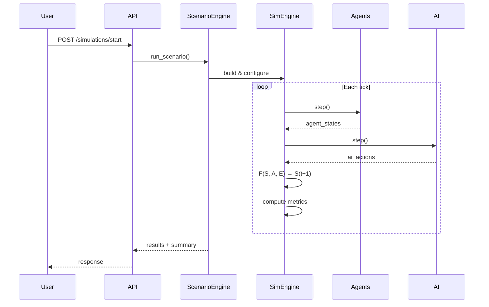

# Architecture

## System Overview

WorldSim AI is built as a layered, modular system with clear separation of concerns. The core follows a formal simulation model:

```
S(t+1) = F(S(t), A(t), E(t))
```

Where:
- **S(t)** — System state at time t
- **A(t)** — Agent actions at time t
- **E(t)** — Environment factors at time t
- **F** — Transition function

## Layers

### 1. Simulation Core (`worldsim/core/`)
The heart of the system. Manages time, state, and the simulation loop.

- **engine.py** — `SimulationEngine` with `run()`, `step()`, `reset()` methods
- **state.py** — `StateManager` for state tracking, snapshots, diffs, and history
- **events.py** — `EventBus` for pub/sub event-driven communication

### 2. Agent System (`worldsim/agents/`)
Agent-based modeling with extensible agent types and behavior models.

- **models.py** — `BaseAgent`, `VehicleAgent`, `HumanAgent`, `MachineAgent`, `EnergyUnitAgent`
- **behaviors.py** — `RuleBasedBehavior`, `ProbabilisticBehavior`

Each agent has:
- `step()` — Execute one simulation tick
- `decide()` — Make decisions using behavior model
- `_act()` — Execute decided action
- `_compute_energy_consumption()` / `_compute_production()` — Resource tracking

### 3. Environment (`worldsim/environment/`)
World representation with zones and resources.

- **world.py** — `GridWorld` (2D grid) and `GraphWorld` (network graph)
- **resources.py** — `ResourceManager` for tracking energy, water, materials

### 4. AI Layer (`worldsim/ai/`)
Intelligence modules that plug into the simulation loop.

- **predictor.py** — `SimplePredictor` (linear regression, moving average) and `AnomalyDetector`
- **optimizer.py** — `ResourceAllocator` (greedy, proportional, LP) and `SimpleScheduler`

### 5. Scenario Engine (`worldsim/scenarios/`)
Define, configure, and run simulation experiments.

- **engine.py** — `ScenarioEngine` with `run_scenario()` and `run_comparison()`
- **definitions.py** — 4 predefined scenarios with full configurations

### 6. API Layer (`worldsim/api/`)
FastAPI REST + WebSocket server.

| Endpoint | Method | Description |
|----------|--------|-------------|
| `/` | GET | API info |
| `/scenarios` | GET | List available scenarios |
| `/simulations/start` | POST | Start a simulation |
| `/simulations` | GET | List all simulations |
| `/simulations/{id}` | GET | Get simulation status |
| `/simulations/{id}/results` | GET | Get simulation results |
| `/simulations/{id}/metrics` | GET | Get aggregated metrics |
| `/ws/simulations/{id}` | WebSocket | Real-time updates |

### 7. Data Pipeline (`worldsim/data/`)
- **generator.py** — `SyntheticDataGenerator` for agents, worlds, time series

### 8. Utilities (`worldsim/utils/`)
- **config.py** — `ConfigManager` for YAML/JSON config files
- **metrics.py** — `MetricsCollector` and `ResultsExporter`

## Data Flow



## Event System

The event bus enables loose coupling between components:

```
EventType.TICK              — Each simulation tick
EventType.AGENT_MOVED       — Agent position changed
EventType.RESOURCE_CONSUMED — Resource used
EventType.SYSTEM_FAILURE    — Something broke
EventType.ANOMALY_DETECTED  — AI found something weird
```

Components subscribe to events they care about without knowing about each other.

## Extension Points

1. **New agent types** — Subclass `BaseAgent`
2. **New behavior models** — Subclass `BehaviorModel`
3. **New environments** — Subclass `GridWorld` or implement from scratch
4. **New AI modules** — Implement `step(tick, state, env_state, agent_states)` method
5. **New scenarios** — Add config dict to `definitions.py`
6. **New metrics** — Record via `MetricsCollector`
